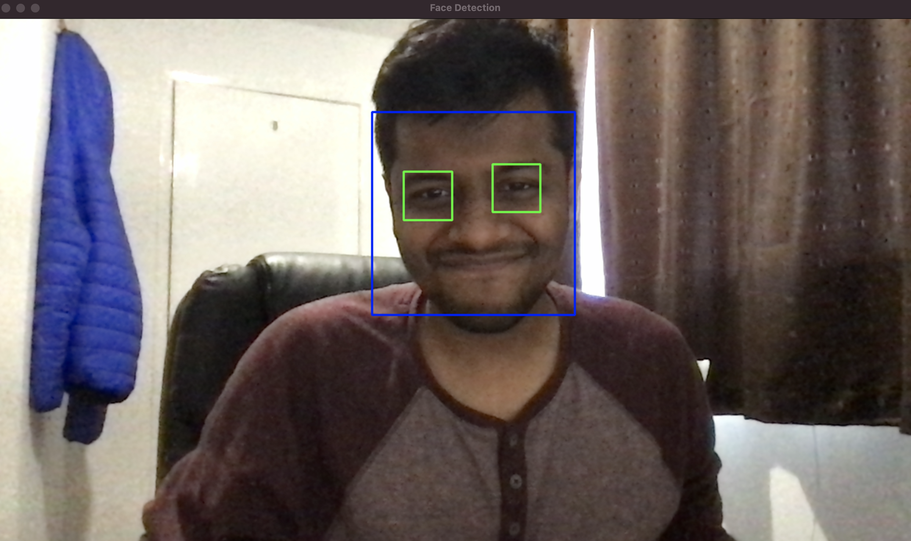
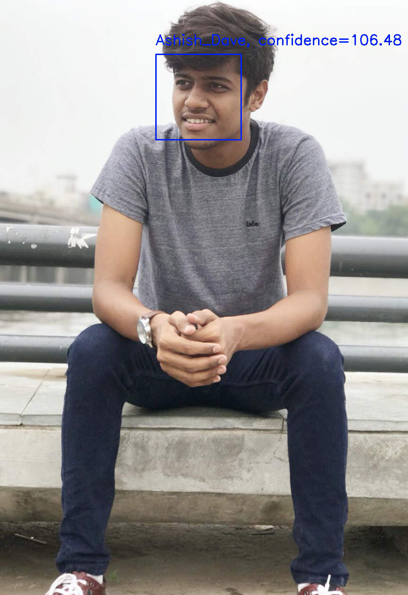
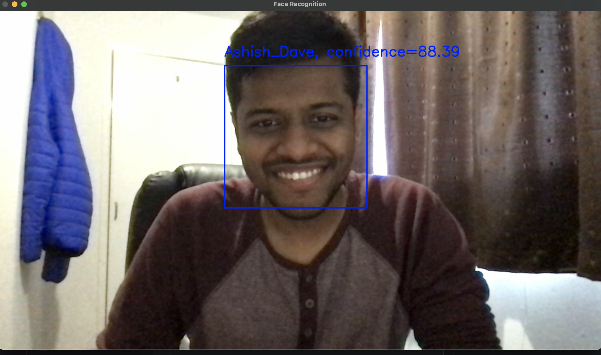

# Face Recognition and Eye Detection

The Aim of this small hands-on was to understand how one could implement face recognition, train the model and use it. 


## development setup

Install conda environment and the api in editable mode:

```console
conda env create -f conda.yml
conda activate face_recognition
pip install -r requirements.txt
```

## Functionalities

1. Provided any image or using live web cam detect the faces and eyes of the person.
2. I have trained a model where I have provided two categories, one contains my images and other contains random images, once it's trained I am testing the model by either providing images or using live web cam to see if the model is able to classify the correct category or not.





